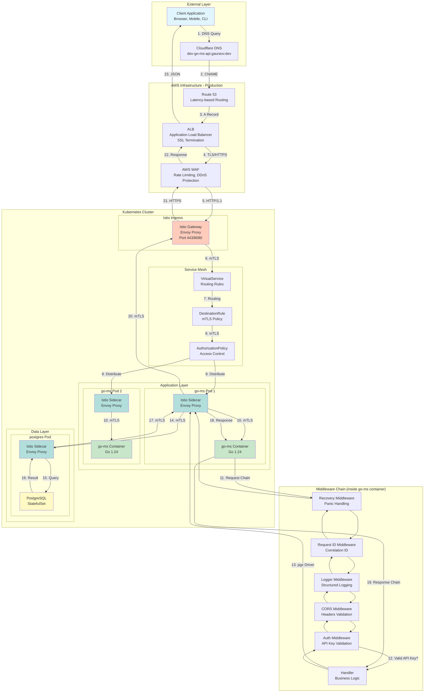
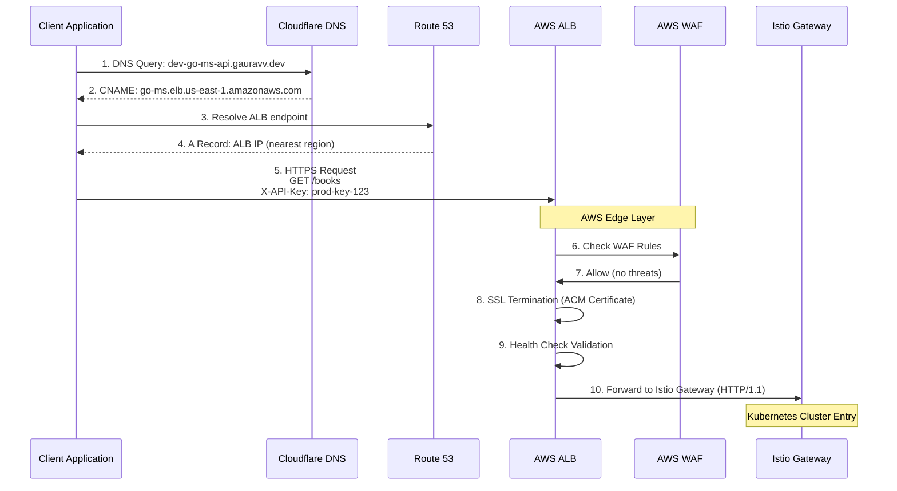
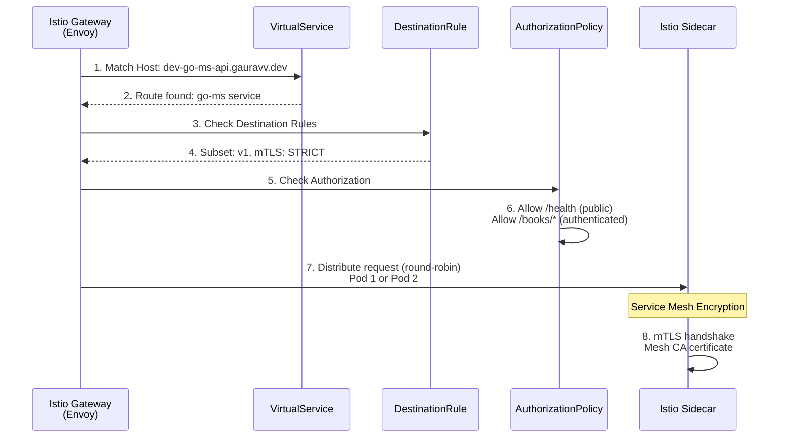
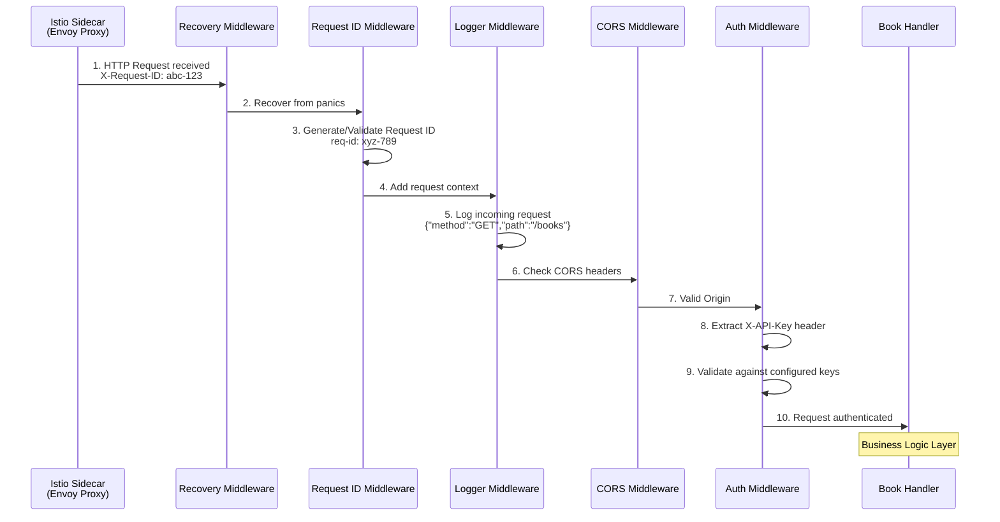
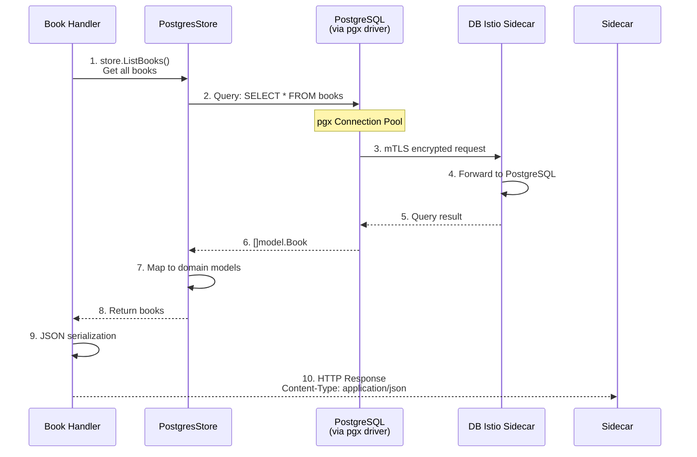
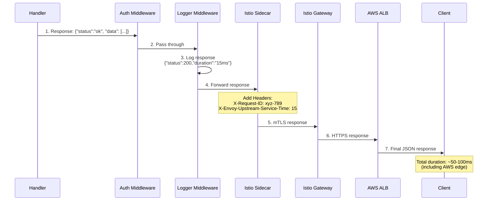
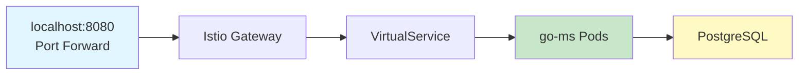
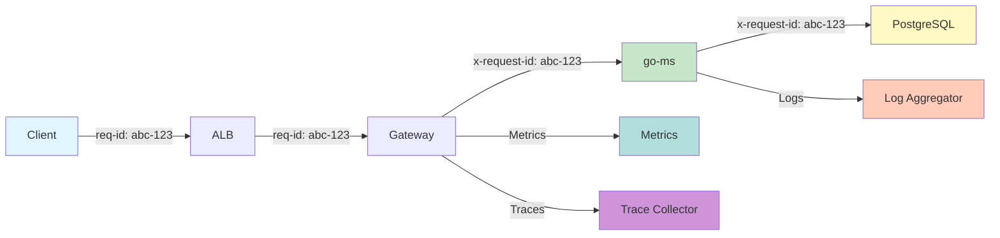

# Request Lifecycle - Go Microservice Architecture

This document diagrams the complete lifecycle of an HTTP request through the Go microservice architecture, from external client to database and back.

---

## Overview Diagram



---

## Detailed Request Flow

### Phase 1: External Entry (Production AWS)



### Phase 2: Kubernetes Service Mesh Entry



### Phase 3: Application Middleware Chain



### Phase 4: Handler to Database



### Phase 5: Response Journey



---

## Component Communication Details

### 1. Client → Cloudflare DNS

```
Request:  DNS A record query
Domain:   dev-go-ms-api.gauravv.dev
Response: CNAME → go-ms.elb.us-east-1.amazonaws.com
```

### 2. Route 53 → ALB

```
Routing Policy:   Latency-based
Health Check:    HTTPS:443/health
Target:          ALB in nearest AWS region
```

### 3. ALB → Istio Gateway

```
Protocol:         HTTP/1.1 (after SSL termination)
Target Port:      8080 (service mesh)
Health Check:     /health endpoint every 30s
```

### 4. Istio Gateway → VirtualService

```yaml
# VirtualService routing rules
apiVersion: networking.istio.io/v1beta1
kind: VirtualService
spec:
  hosts:
  - "dev-go-ms-api.gauravv.dev"
  gateways:
  - go-ms-gateway
  http:
  - match:
    - uri:
        prefix: /books
    route:
    - destination:
        host: go-ms
        subset: v1
      weight: 100
```

### 5. VirtualService → DestinationRule

```yaml
# mTLS and traffic policy
apiVersion: networking.istio.io/v1beta1
kind: DestinationRule
spec:
  host: go-ms
  trafficPolicy:
    tls:
      mode: ISTIO_MUTUAL  # mTLS between services
    loadBalancer:
      simple: ROUND_ROBIN
```

### 6. AuthorizationPolicy

```yaml
# Access control
apiVersion: security.istio.io/v1beta1
kind: AuthorizationPolicy
spec:
  selector:
    matchLabels:
      app: go-ms
  rules:
  - to:
    - operation:
        paths: ["/health"]
  - when:
    - key: request.headers[X-API-Key]
      values: ["prod-key-123", "dev-key-456"]
```

### 7. Istio Sidecar → Application Container

```
Communication:   localhost (same pod)
Protocol:        HTTP/1.1
Headers Added:
  - X-Request-ID
  - X-Forwarded-For
  - X-Envoy-Original-Path
```

### 8. Application → PostgreSQL

```
Driver:          pgx/v5 (pure Go PostgreSQL driver)
Connection Pool:  5 max connections
Query Timeout:   30 seconds
Idle Timeout:    5 minutes
```

---

## Middleware Chain Details

```go
// Middleware execution order (cmd/server/main.go)

func main() {
    mux := http.NewServeMux()

    // Middleware chain (applied in reverse order of wrapping)
    handler := middleware.Recovery(
        middleware.RequestID(
            middleware.Logger(
                middleware.CORS(
                    middleware.Auth(
                        handler.Routes(),
                    ),
                ),
            ),
        ),
    )

    // Final chain:
    // Request → Recovery → RequestID → Logger → CORS → Auth → Handler
}
```

### Each Middleware's Role

| Middleware | Responsibility | Example Action |
|-------------|------------------|----------------|
| **Recovery** | Catch panics | Log error, return 500 |
| **RequestID** | Correlation | Generate/read `X-Request-ID` header |
| **Logger** | Observability | Log method, path, status, duration |
| **CORS** | Browser security | Add `Access-Control-Allow-Origin` header |
| **Auth** | Authorization | Validate `X-API-Key` header |

---

## Local Development Flow (k3d)

When running locally with `make local-up`:



**Access Methods:**

```bash
# Method 1: Port-forward (simplest)
kubectl port-forward -n go-ms svc/go-ms 8080:8080
curl http://localhost:8080/health

# Method 2: Via /etc/hosts (simulates production)
127.0.0.1 dev-go-ms-api.gauravv.dev
curl http://dev-go-ms-api.gauravv.dev:8443/health

# Method 3: Direct pod access
kubectl exec -n go-ms <pod-name> -- curl http://localhost:8080/health
```

---

## Time Breakdown (Typical Request)

| Phase | Duration | Notes |
|-------|----------|-------|
| **Client → AWS Edge** | 10-30ms | DNS + Route 53 latency routing |
| **ALB → Istio Gateway** | 5-10ms | VPC network, load balancer |
| **Istio Gateway → Sidecar** | 2-5ms | Service mesh routing |
| **Middleware Processing** | <1ms | In-memory Go code |
| **Handler → Database** | 5-15ms | Query execution + connection pool |
| **Return Path** | Same | Response follows same path back |
| **Total** | **25-60ms** | End-to-end for simple GET |

---

## Security in Transit

```mermaid
graph TB
    subgraph "Encryption Layers"
        L1[Layer 1: Client → ALB<br/>TLS 1.3 (ACM Certificate)]
        L2[Layer 2: ALB → Gateway<br/>HTTPS (VPC-internal)]
        L3[Layer 3: Service Mesh<br/>mTLS (ISTIO_MUTUAL)]
        L4[Layer 4: Pod → Pod<br/>mTLS (sidecar-to-sidecar)]
    end

    L1 --> L2 --> L3 --> L4

    style L1 fill:#c8e6c9
    style L2 fill:#a5d6a7
    style L3 fill:#81c784
    style L4 fill:#4caf50
```

**All traffic is encrypted:**
1. **Client ↔ ALB:** Public TLS (Let's Encrypt via cert-manager)
2. **ALB ↔ Gateway:** VPC-internal HTTPS
3. **Service ↔ Service:** mTLS (Istio automatic)
4. **App ↔ Database:** mTLS (service mesh enforcement)

---

## Observability: Distributed Tracing



**Every request has:**
- **Request ID:** Traces from client to database
- **Structured Logs:** JSON format with correlation
- **Metrics:** Request count, latency, error rate
- **Traces:** Span tree in Jaeger (optional add-on)

---

## Summary

The request flows through **7 distinct layers**:

1. **External DNS** (Cloudflare → Route 53)
2. **AWS Edge** (ALB + WAF)
3. **Service Mesh Entry** (Istio Gateway)
4. **Service Mesh Routing** (VirtualService → DestinationRule)
5. **Authorization** (AuthorizationPolicy)
6. **Application** (Middleware chain → Handler)
7. **Data Layer** (PostgreSQL via pgx)

**Key Characteristics:**
- ✅ All traffic encrypted (3 layers)
- ✅ Authentication at mesh edge (API key)
- ✅ Authorization per endpoint (policy-based)
- ✅ Observability throughout (request ID correlation)
- ✅ Zero single point of failure (multi-AZ, multi-pod)

---

**Last Updated:** 2026-02-12
**Stack:** Go 1.24 + Istio 1.24 + PostgreSQL 15 + AWS EKS
